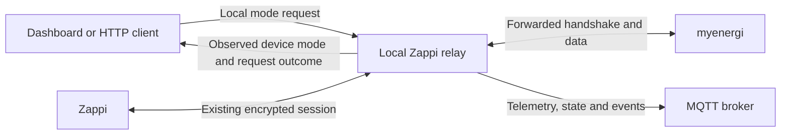

# How local control and cloud forwarding work

Local Zappi sends mode commands directly to the charger and reads its telemetry. The running relay shares the session negotiated between the charger and myenergi. It does not yet terminate two independent sessions or replace the cloud's handshake and application replies.

## What happens when you press Fast

The server checks forwarding, recent decrypted device traffic, a known control target and a recently verified cloud reply. It queues the request, then constructs a new encrypted mode command on the next valid charger poll and sends it through the existing reverse-NAT route. It does not call the myenergi HTTP API to perform the mode change.

The request initially has status `queued`, then `sent_unconfirmed` once transmitted. Only a subsequent device report updates the displayed mode. Matching telemetry within 30 seconds confirms the request; otherwise its status becomes `not_confirmed`. A mode is a charging policy, not proof that the vehicle is drawing power.

Device UDP telemetry continues to myenergi unchanged. The server also observes local Ethernet telemetry when capture is enabled. MQTT and the dashboard consume these observations without sending fabricated device state to the cloud.

## Why cloud forwarding is still required

The running server forwards myenergi's session negotiation and application replies. Its passive recovery code extracts and verifies supported replacement keys after reconnects. This keeps local command generation working after a charger reboot, but it does not make the server the session authority.

The code enforces that boundary:

- `server.py` returns `offline_control_supported: false` in status
- `POST /mode` rejects requests when `relay.forward` is false
- `Control.ready()` requires both device traffic and a verified upstream reply less than 30 seconds old
- `SessionNegotiator` in `protocol.py` is used by tests and the emulator, not the runtime relay

Passive Ethernet observations can continue without cloud forwarding. Sustained independent command operation is not implemented, even if a previously negotiated key remains in memory briefly after an upstream outage.

## What independent sessions still need

The standalone negotiator establishes a server-chosen key against firmware emulation. Runtime integration still needs separate charger-facing and cloud-facing session state, the cloud-client exchange, application replies, and translation between the two sessions. It also needs coordination of counters, acknowledgements, command ordering and reconnects, plus live outage and recovery tests.

The current sender tracks observed command counters and generates matching sequence bits. It does not isolate local commands from concurrent cloud commands. Existing automations and app requests can still supersede a locally confirmed mode.

## Persistence and diagnostic limits

The private data directory persists the access key, session key, forwarding setting and two bounded journals. Startup can recover a verified key and restore a recent command counter from matching journal records. Device reports, current readiness, observed configuration and the latest local request are held in memory and repopulate after a restart.

The session readiness field describes the cryptographic traffic and target checks. The HTTP mode endpoint additionally checks forwarding. A ready session or successful UDP send does not prove that a mode request will be accepted. The [device confirmation loop](device-mode.md) supplies that later observation.
